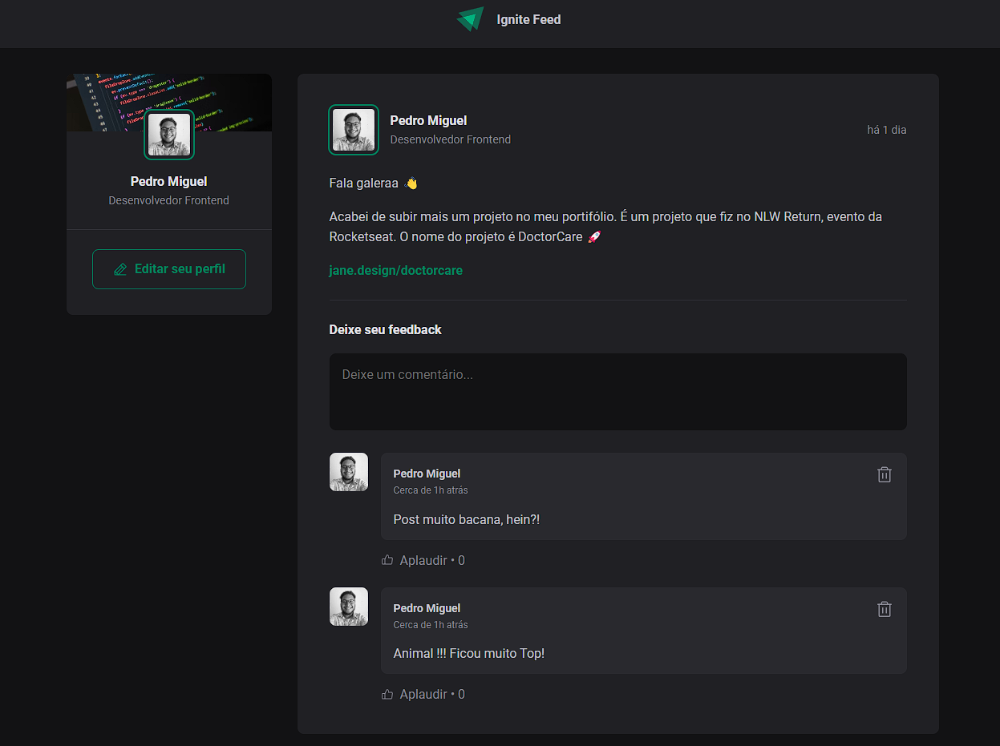

# Ignite Feed

  
   

<h3 align="center">Eventos incríveis em um só lugar!</h3>

Ignite feed é um projeto simples que simula o feed das redes sociais,  com funcionalidades de comentários, likes e apagar comentário.

  
  
  
  

## Funcionalidades

<ul>
  [x] - adicionar comentários 
  [x] - aplaudir (likes) 
  [x] - apagar comentário 
</ul>

## Como usar

1. Clonar repositório
``git clone https://github.com/arkanael/ignite-feed-react.git ``

2. Instalar dependências
``yarn`` ou ``npm i``

3. Subir projeto Local
``yarn dev`` ou ``npm run dev``

4. Acessar projeto
``http://localhost:3000/``

## Tecnologias utilizadas

<ul>
  <li>ReactJS</li> 
  <li>Vite</li> 
  <li>React Dom</li> 
  <li>Date-fns</li> 
  <li>Phosphor-react</li> 
</ul>

## Considerações finais

### Desenvolvido por ``Luiz Guilherme Bandeira - @arkanael``